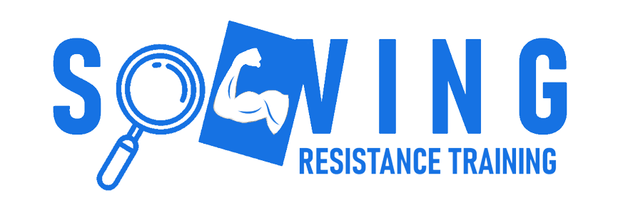

The primary goal of SolvingRT is to standardize exercise mechanics in a non-intrusive way, 
by measuring certain aspect of the lift with a video.

<a href="https://samueleblanc.com/solvingrt/documentation.html" target="_blank">Full documentation</a>
## Requirements
For SolvingRT to work, you need <a href="https://google.github.io/mediapipe/getting_started/python.html" target="_blank">MediaPipe</a>, 
<a href="https://opencv.org/releases/" target="_blank">OpenCV</a> and <a href="https://matplotlib.org/stable/users/getting_started/" target="_blank">Matplotlib</a>.
## Installation
```
pip install git+https://github.com/samueleblanc/SolvingRT.git
```
## Example
```
import solvingrt.solve as srt

ath1 = srt.Athlete(1.85, 100, 0.35, 10, "left")
ex1 = srt.Exercise("Preacher curl", "biceps", "path/to/video/preacher_curl.mp4", ath1, ["torque", "velocity lost"])

ex1.video_resize(720, 400)
ex1.angle_with_gravity()

ex1.play_video()
```
### Output


```
Data calculated for each rep: [['Rep #1', 'Torque: 24.7202 Nm'], ['Rep #2', 'Torque: 24.4874 Nm'], ['Rep #3', 'Torque: 23.8655 Nm'], ['Rep #4', 'Torque: 25.0046 Nm'], ['Rep #5', 'Torque: 24.5612 Nm']]
Data calculated for the set: ['Velocity lost: 27.03%']
```
## Available measures
* speed (angular velocity)
* torque
* power
* work
* time under tension
* angles (min and max angle)
* velocity lost
* parallel
* tempo (time spent in the eccentric and concentric portion only)
* resistance profile (graph of the torque for every angle)

## Known limitations
Please take into consideration the angle in which the video is filmed, based on your goals.
For instance, if the goal is to measure power (torque times angular velocity) in a biceps curl,
selecting a video with a side view is the only right way to do it.

The video must be filmed without an angle, but it doesn't matter if it is in portrait or landscape (see below).


The reason is that the force of gravity is treated as being parallel to the height of the video, 
not perpendicular to the gym floor.

As of right now, only exercises that uses dumbbell (DB) or barbell (BB) works for every measure.

Only muscle groups as a whole can be selected. For example, you can only select "back" and not "rhomboids".
## Contributing
Thank you for considering to help out! Pull requests and issues are welcomed!

Please add comments to your code.
## In the future
Short/medium term goals are to 
* Make it faster and more performant
* Make it more specific for various muscle groups
    * e.g. "upper chest" vs "lower chest"
* Make it compatible with cable exercises
* Add more measures
## License
MIT
